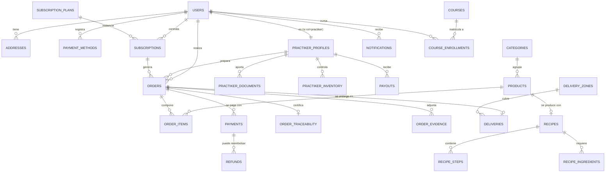

# PRACTIKA — Modelo Entidad-Relación

> Versión 0.1. El esquema SQL ejecutable está en `../database/schema.sql`.

## 1. Diagrama ER (Mermaid)

## 2. Entidades principales

### Usuarios y acceso
- **users**: identidad única. Campo `role` (`cliente` | `practiker` | `admin`).
  Soporta login por email/contraseña y proveedores OAuth (`auth_provider`,
  `provider_user_id`). Contraseña **hasheada** (argon2/bcrypt).
- **addresses**: direcciones del cliente (una principal + secundarias), con lat/lng.
- **payment_methods**: tokens de pasarela (nunca se guarda el número de tarjeta).
- **practiker_profiles**: extensión 1:1 de `users` para operadores (rating, ubicación,
  carga de trabajo, estado de validación).
- **practiker_documents**: documentación y certificaciones, validadas por admin.

### Catálogo y producción
- **categories**: Bases, Salsas, Soluciones Listas/Vegetales, Proteínas.
- **products**: ficha completa (nutrición, gramaje, vencimiento, stock sugerido, vacío).
- **recipes** / **recipe_steps** / **recipe_ingredients**: receta estandarizada del chef,
  con puntos críticos de control y especificación de vacío.

### Suscripciones y pedidos
- **subscription_plans**: catálogo de planes (semanal/quincenal/mensual).
- **subscriptions**: contrato del cliente (estado: activa, pausada, cancelada),
  renovación automática, fechas de ciclo.
- **orders**: pedido con máquina de estados
  (`pendiente → asignado → preparando → empaque_listo → en_ruta → entregado`),
  más cancelado.
- **order_items**: líneas del pedido.
- **order_traceability**: registro HACCP (lote, peso, presión, temperatura, tiempo).
- **order_evidence**: fotos/videos/firma con URL en S3 y hash de integridad.

### Logística
- **delivery_zones**: zonas y coberturas con polígono geográfico.
- **deliveries**: ventana, ruta, GPS y confirmación de entrega.

### Pagos
- **payments**: transacción por pasarela (Stripe/MercadoPago/ePayco/Bold/PayPal).
- **refunds**: reembolsos asociados.
- **payouts**: liquidaciones a practikers (comisiones, transferencias).

### IA y soporte
- **demand_forecasts**: pronósticos generados (semana/mes, materias primas, déficit).
- **assistant_conversations** / **assistant_messages**: historial del chat inteligente.

### Educación y comunidad
- **courses**, **course_lessons**, **course_enrollments**, **course_certificates**.

### Transversales
- **notifications**: push/SMS/email/WhatsApp con estado de envío.
- **audit_logs**: auditoría de acciones administrativas y de seguridad.

## 3. Reglas de negocio clave (a reflejar en BD y backend)

1. Un pedido `pendiente` solo puede ser reclamado por un practiker (control de carrera →
   transacción + bloqueo optimista en `orders.status`).
2. El paso a `empaque_listo` exige registro de trazabilidad HACCP completo.
3. Una suscripción pausada no genera pedidos hasta reactivarse.
4. Las contraseñas nunca viajan ni se almacenan en claro.
5. Los montos se guardan en **enteros (centavos)** para evitar errores de coma flotante.
6. Todo borrado de catálogo es **lógico** (`is_active = false`), nunca físico, para no
   romper históricos de pedidos.

## 4. Notas de migración desde el prototipo

El prototipo usa IDs string (`prod-ajo-01`, `op-01`, `ord-101`). En producción:
- PK con `UUID` (gen_random_uuid()).
- Se conserva un campo `legacy_id`/`sku` legible para humanos donde aporte (ej. SKU de
  producto, código de lote).
- Los enums del prototipo (`OrderStatus`, `CategoryType`) se mapean a tipos `ENUM` de
  PostgreSQL o tablas de catálogo.
